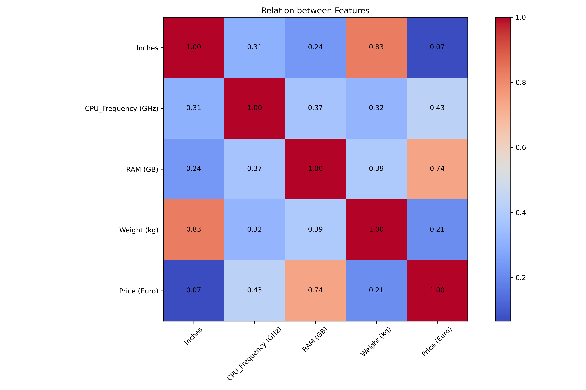

# About this repository

I will be doing some exploratory analysis on several topics throughout this repository. 

## FIRST PROJECT: Analysing relation between features in laptops

### Description

This project tries to analyse the pricing in laptops (euros) from a dataset created by Iron Wolf in Kaggle.

This dataset contains a variety of laptop specifications and the price of each device in Euros.

My objective was to evaluate the relations between features (heatmap graph).

Data from: August, 2024.

### Graphics

### Conclussions

* The weight is directly related to the inches
* The pricing has a lot to do with the RAM and some relation with the CPU Frequency
* We would need more data in regards to pricing, as the dataset doesn't take into account other CPU/GPU features